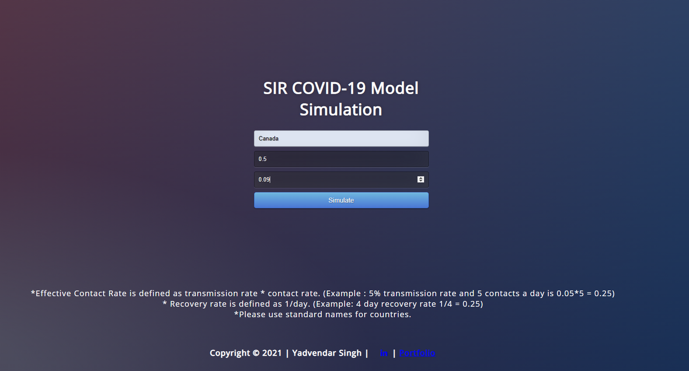
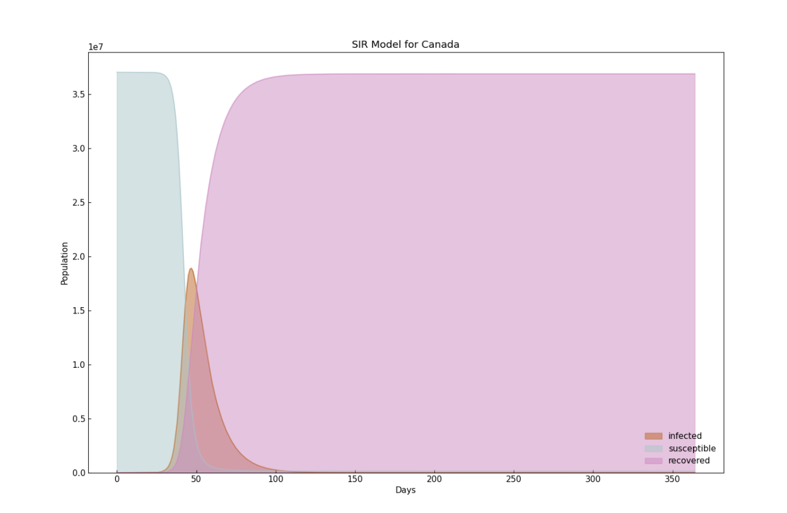

### SIRModelDeployment
#### This repo presents you the model deployment solution on aws. The model can be used to simulate covid-19 scenarios across globe.

### Front end is made using HTML and CSS, backend is made using Flask. The entire model is deployed on AWS and is being used for research.

### Business Understanding
  
  1. This model will help user simulate SIR Model in their specific country
  2. This is just a simple SIR model. It doesn't take into effect all the measures taken by a government.

  SIR Model

  The SIR epidemic model is a simple mathematical description of the spread of disease in a population. It divides the population into 3 compartments which may vary as a fucntion of time t, and space x:
  
  S(t) = are those who are susceptible but not infected yet.
  I(t) = are those who are infected.
  R(t) = are those who have recovered from the disease and now have immunity to it.
  
  The SIR model describes the changes in the population of each of three compartments using &beta; and &gamma;. &beta; describes the effective contact rate of the disease. &gamma; describes the mean recovery rate. An infected individual comes into contact with &beta;N other individuals per unit time (of which the fraction that are a susceptible to contracting the disease of S/N). 1/&gamma; is the mean period of time during which an infected individual can pass it on.
   
   
  
  The differential equations describing this model were first derived by Kermack and McKendrick:
  
  dS/dT = &beta;SI/N  
  dI/dT = &beta;SI/N - &gamma;I   
  dR/dT = &gamma;I  
  
  N = S+I+R is the total population, T is the elapsed time from the start date.

  SIR model Implementation.
  
  We'll use differential equations to calculate the population change over time.
  
  Effective contact rate is transmission rate * contact rate, so:
  
  5% transmission rate and 5 contacts a day is 0.05*5 = 0.25
  Recovery rate is 1/day
 
  14 day recovery rate 1/14 = 0.07

